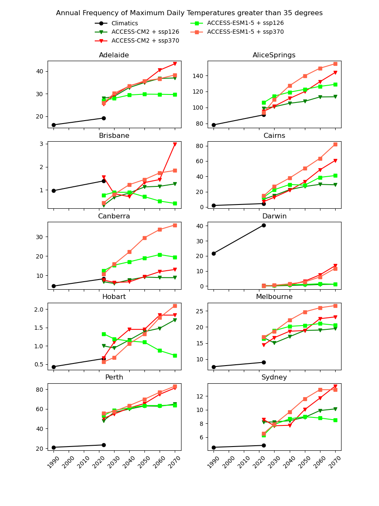

layout: page
title: "Test title"
permalink: /cmip6_to_agcd_problem_statement

# Research Problem: Estimating High-Resolution Weather Metrics from Climate Model Data

## Definitions

- **Variable:** A simple weather observation such as daily maximum temperature or daily total precipitation.
- **Metric:** A derived measure based on variables, such as "the average number of days per year where the maximum temperature exceeds 40°C" or "the average number of days per year with more than 10mm of rainfall." More complex metrics include heatwaves,  and Standard Precipitation Index (SPI) statistics.

## Introduction

The goal of this research is to develop a method for producing continuous graphs of weather metrics over time, from 1950 to 2100, at a given point in Australia. This involves integrating two datasets of gridded weather data: the Bureau of Meteorology (BoM) Australian Gridded Climate Dataset (AGCD) and the CMIP6 climate model data. The AGCD has a spatial resolution of 0.05 degrees and is derived from interpolating weather observations from 1950 to present. The CMIP6 dataset, on the other hand, simulates the climate under various emissions scenarios from 2015 to 2100 and has a spatial resolution of approximately 0.25 degrees.

There are existing efforts to "downscale" CMIP6 data using physics-based approaches. In our testing, we have found these still have very poor agreement with current observations.

## Problem Statement

 Whenever plotting metric values over time, a significant challenge arises from the discrepancy between the historical AGCD data and the CMIP6 model data, leading to a discontinuity at the transition year (2024). This is primarily due to the different spatial resolutions of the datasets; the larger area covered by CMIP6 pixels tends to average out extreme values, which is problematic for our focus on weather extremes. While this information is fundamentally not present in the climate models, we hope to artificially reconstruct it using some kind of mathematical model with the CMIP6 data (and potentially some other relevant data) as exogenous variables and the AGCD variable or specific metrics as the endogenous variables.

## Methodological Approaches

### Approach 1: Pixel-by-Pixel Deterministic Model
- **Model Construction:** Fit deterministic models (e.g., multilinear regression) for each AGCD pixel to translate CMIP6 pixels based on overlapping data from 2015 to 2024.
  - **Variable-Specific Models:** Develop separate models for each weather variable (e.g., daily maximum temperature, precipitation).
  - **Statistical Basis:** Use statistical correlations rather than direct day-to-day correlations due to CMIP6's climatological scale.
  - **Mean Preservation:** Optionally enforce that the mean of the AGCD equals the CMIP6 or ignore this to simplify the model.

### Approach 2: Metric-Specific Deterministic Model
- **Model Construction:** Develop deterministic models for each metric directly, rather than for individual variables.
  - **Metric Continuity:** More likely to produce continuous graphs of metrics over time.
  - **Relational Consistency:** Ensure metrics have sensible relative values (e.g., days over 40°C should always be fewer than days over 35°C).

### Approach 3: Multivariable Models
- **Complexity Consideration:** Develop models considering multiple variables simultaneously on a per-pixel basis (either CMIP6 or AGCD pixels).
  - **Weather Paradigms:** Different models for different weather conditions (e.g., hot dry summer days vs. cold wet days).

### Additional Considerations
- **Noise Addition:** Incorporate random or semi-random noise to recapture extremes lost due to spatial averaging in CMIP6.
- **Auxiliary Variables:** Include additional variables such as terrain elevation and land use types.
- **Consistency Rules:** Enforce that the 25 subpixels must average out to the corresponding CMIP6 value.
- **Scenario and Model-Runs:** Address multiple CMIP6 scenarios and model-runs (e.g., ACCESS CM2, TaiESM1, EC-Earth3) and determine if separate models are necessary for each.

## Conclusion

The research aims to develop a method to estimate high-resolution weather metrics from CMIP6 data, providing a seamless transition from historical AGCD observations. This involves addressing spatial resolution discrepancies and ensuring the preservation of weather extremes, with the ultimate goal of producing reliable and continuous weather metric graphs over an extended period.